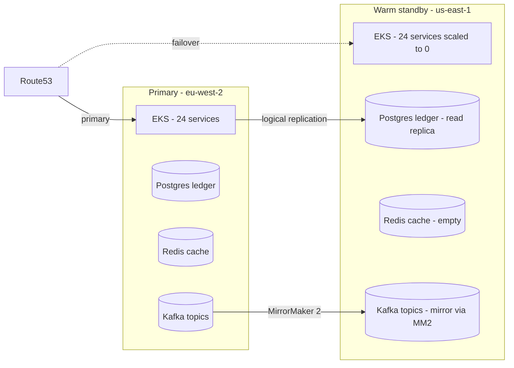

# Multi-region DR strategy (forward-looking)

This is the design we point exec audiences at when they ask "what
about disaster recovery?". The current demo runs one EKS cluster in
`eu-west-2`; the strategy below is what the production version of
this stack would look like and what the next sprint of demo work
would deliver if a customer asks us to prove it on stage.

## Pattern: hot-warm active-passive across two AWS regions



## Components

* **Compute:** identical 24-service Helm release in both regions. The
  warm-standby region keeps every Deployment at `replicas: 0` until
  failover; HPA targets and resource requests are shared via a single
  Helm chart, parameterised by `region` and `replicasOverride`.
* **State:**
  * Postgres ledger uses logical replication into a read-replica in
    the standby region. RPO target: < 30 s.
  * Redis is rebuilt cold on failover (cache, not state); we accept
    a warm-up p99 spike for the first 5 min.
  * Kafka topics replicate via MirrorMaker 2 with a `dr.` prefix in
    the standby region.
* **Network:** Route53 health-checked failover record. SCP-friendly
  alternative is a Splunk Synthetic global-load-balancer test that
  rewrites the target on failure.
* **Identity & secrets:** AWS Secrets Manager replication across
  regions; IAM roles via OIDC trust to both EKS clusters.
* **Telemetry:** the OTel Collector chart deploys identically to
  both regions and sends to the same Splunk Observability realm with
  `region` resource attribute set, so APM / RUM / metrics views see
  both.

## Failover criteria (machine, not human)

A `signalfx_detector` chains three signals:
1. Splunk Synthetics `[NatWest demo] payments gateway` API check fails
   from > 2 of 3 cloud agents for 2 minutes.
2. `payment-success-rate` SLO burn rate exceeds 14.4x for 1 minute.
3. AWS health event for `eu-west-2` lists "Service degradation".

If two of three fire, the SOAR simulator (or real Splunk SOAR)
executes the `region-failover` playbook:

```
1. Promote us-east-1 Postgres replica to writable
2. helm scale --replicas=<rated_capacity> in us-east-1 cluster
3. Update Route53 weighted record to 100% us-east-1
4. Post status-page incident "Failed over to us-east-1"
5. Open ServiceNow major-incident ticket
```

## Recovery time objectives

| Surface                     | RTO    | RPO   | Why                                |
|-----------------------------|--------|-------|------------------------------------|
| Card payments (FPS / CHAPS) | 5 min  | 30 s  | Postgres logical replication lag   |
| SWIFT outbound              | 15 min | 5 min | Pre-failover MQ drain handshake    |
| Mobile / online banking     | 5 min  | n/a   | Stateless web tier, Route53 flip   |
| Sanctions / fraud screening | 10 min | n/a   | Cold model load on standby         |
| ATM estate                  | 30 min | n/a   | Switch endpoints rebooted in batches |

## Demo cost note

Building this in the demo cluster doubles AWS spend (roughly +£900 /
month at current rates). We default to documenting the strategy in
this file rather than provisioning the standby region; if a customer
wants to see a *live* failover we can stand up the second cluster as
a one-off, demonstrate, and tear it down via `terraform destroy
-target=module.region_standby`.

## What would be added to the codebase to make this real

1. New Terraform module `terraform/modules/region/` parameterised by
   `region` so `main.tf` can instantiate it twice.
2. Terraform `aws_route53_health_check` + failover routing record.
3. `helm/natwest-payments/templates/postgres.yaml` updated to support
   logical-replication subscriber mode.
4. New helm template `helm/natwest-payments/templates/kafka-mm2.yaml`
   running `org.apache.kafka.connect.mirror.MirrorSourceConnector`.
5. New SOAR playbook `region-failover` in
   `helm/natwest-payments/templates/soar-simulator.yaml`.
6. Two new glass-table panels: "Active region" + "Standby replication
   lag (s)".

These are scoped tasks but each is half-day to a day; the whole
package is a sprint.
