# C-Level 30-minute top-down demo runbook

**Audience.** NatWest platform leader + C-level execs (mixed
technical / business). The mental anchor is _"COO opens a Glass Table
at 09:00 and answers 'is the business healthy, and if not, who's
fixing it?' without writing a single search."_

**Cut.** Top-down. Starts at the Overview Glass Table, lands the
deep-dive in Splunk Observability APM, weaves a live mid-demo chaos
inject to demonstrate breadth. Complements - does not replace - the
bottom-up engineer cut in
[`docs/presentation/TALK_TRACK.md`](./TALK_TRACK.md).

**Narrative threads woven through.**

- **Depth** (SWIFT incident, pre-armed at T-15): how Splunk gets a
  single SRE from "red tile" to root cause in under six minutes.
- **Breadth** (Madrid incident, injected live at 0:16): how the same
  platform catches a completely different class of incident in a
  completely different geography, with no extra tooling.

**Runtime.** 27 min content + 3 min Q&A buffer.

> Companion artefacts:
>
> - [`SLIDES.md`](./SLIDES.md) - Marp deck (Acts I & II, bottom-up).
> - [`TALK_TRACK.md`](./TALK_TRACK.md) - bottom-up presenter script
>   (used in 30 / 45 / 60-min cuts for technical audiences).
> - [`../../scripts/run-of-show.md`](../../scripts/run-of-show.md) -
>   keyboard-driver commands and cluster checks. The pre-flight
>   quick-reference card at the bottom of that file maps 1:1 to the
>   T-15 / T-12 / T-5 / T-2 steps below.

---

## Pre-flight (T-15 min, off-stage)

| When | Step | Verifies |
|------|------|----------|
| T-15 | **Arm SWIFT** via the SPA Chaos Dashboard ([`/ops`](../../frontend/src/pages/Ops.tsx)) - click **Inject** on `swift-counterparty-flap`. CLI fallback: `scripts/incident.sh swift-counterparty-flap`. | `[NatWest demo] SWIFT error rate` detector fires (~3 min). ITSI episode `Payments incident on swift-network` exists when the audience walks in. |
| T-12 | Hard-refresh the Overview Glass Table tab; confirm the **Active payments incident - notable events** panel shows the SWIFT episode. | Pre-arm matured into a visible ITSI notable event. |
| T-5  | Open browser tabs in left-to-right order: (1) Overview Glass Table, (2) ITSI Episode Review, (3) APM Service Map, (4) RUM Overview, (5) `/ops` Chaos Dashboard, (6) SLOs page. | All known-loaded, no auth dialogs mid-demo. The `/ops` tab is _last_ so it isn't visible in the tab strip before the reveal. |
| T-2  | Enable Presenter HUD (`?presenter=1` on the SPA) on a secondary screen. | Trace IDs + chaos status visible on the operator screen, never projected. |
| T-0  | Press start. | |

**Fallback if SWIFT never surfaces as an episode.** Point at the
`[NatWest demo] SWIFT error rate` detector directly in Observability
(see `terraform/observability.tf`) and walk the same drill-path. Same
content, one click extra.

**Recovery (after the demo).** From the keyboard:

```bash
make chaos-recover     # POST /chaos/api/recover via dashboard backend
# fallback if /ops is offline:
scripts/incident.sh recover
```

Both produce the same cluster state - see the comment header in
[`scripts/incident.sh`](../../scripts/incident.sh) for the
audit-trail symmetry.

---

## Timeline

```mermaid
flowchart LR
    A["0-2 min<br/>Frame"] --> B["2-7 min<br/>Overview Glass Table<br/>ITSI: business KPIs, L1/L2/Tier, Episode visible"]
    B --> C["7-10 min<br/>ITSI Episode Review<br/>+ Service Analyser"]
    C --> D["10-16 min<br/>APM root cause<br/>service map, Tag Spotlight,<br/>trace, Logs in Context"]
    D --> E["16-17 min<br/>LIVE INJECT<br/>madrid-network-degradation"]
    E --> F["17-21 min<br/>RUM / DXA<br/>customer-side same incident"]
    F --> G["21-25 min<br/>Madrid episode lights up<br/>ITSI breadth + ThousandEyes"]
    G --> H["25-27 min<br/>SLO burn + close"]
    H --> I["27-30 min<br/>Q&A"]
```



---

## 0:00 - 0:02 &nbsp; Frame &nbsp; (2 min)

One sentence, no architecture boxes:

> "This is NatWest's card-payments platform - 24 microservices on
> EKS, instrumented end to end with Splunk and Cisco ThousandEyes.
> Everything you'll see is live data from the last 60 seconds."

Jump straight to the Glass Table tab.

---

## 0:02 - 0:07 &nbsp; Overview Glass Table &nbsp; (5 min)
**ITSI capability #1 - Glass Tables**

Walk the panels top-to-bottom, never leaving the Glass Table. Anchor:
[`itsi/glass-table/natwest-payments-overview.xml`](../../itsi/glass-table/natwest-payments-overview.xml).

1. **Top KPI row** - _Payments / minute_, _Value authorised (GBP)_,
   _Customers impacted_, _GBP at risk_, _Payment success rate_.
   > Land: "the COO numbers, automatically rolled up from the audit
   > trail of every payment. This is your daily 09:00 view."
2. **L1 / L2 / Tier health row** - one root score (`nwpay_l1`), nine
   L2 capability tiles, three customer tiers (Bronze / Silver / Gold).
   Service tree definition in
   [`itsi/service-tree.yaml`](../../itsi/service-tree.yaml).
   > Land: "ITSI promotes the 24 microservices into capabilities a
   > business leader can read."
3. **Geography row** - _Payment destinations_, _Customer origin_,
   _Payments by city_.
   > Land: "1.2M payments / day, by country and city, no SPL written."
4. **Tier transaction split + Decline rate by tier** - wealth-management
   point.
   > Land: "Gold customers see lower decline rates because we promoted
   > `customer.tier` to a first-class metric."
5. **Active payments incident - notable events panel** - pause. Point
   at the SWIFT episode.
   > Land: "Here's where it gets interesting. While we've been talking,
   > the platform flagged a payments incident on swift-network. Let me
   > show you what ITSI did with that."

---

## 0:07 - 0:10 &nbsp; ITSI Episode Review + Service Analyser &nbsp; (3 min)
**ITSI capability #2 - Episodes, correlation, aggregation**

1. Click the SWIFT episode &rarr; ITSI **Episode Review**.
   > Land: "This episode aggregates _everything_ the platform has
   > correlated about this incident - alerts from Splunk
   > Observability, audit events from the payments log, even
   > chaos-injection markers if an SRE was experimenting. One episode,
   > one timeline."
2. Show the linked correlation search
   ([`itsi/correlation-searches/o11y_to_itsi.json`](../../itsi/correlation-searches/o11y_to_itsi.json))
   and the aggregation policy
   ([`itsi/aggregation-policies/payments_episode_policy.json`](../../itsi/aggregation-policies/payments_episode_policy.json))
   for 30 seconds.
   > Land: "This isn't magic, it's a 30-line rule the ops team owns."
3. From the episode, drill to **Service Analyser** for
   `nwpay_l3_swift_network`. Show KPIs trending and related entities.
   Click the dashboard-drilldown into **APM**.

---

## 0:10 - 0:16 &nbsp; APM root cause &nbsp; (6 min, **deepest segment**)
**Splunk Observability capability #1 - APM**

1. **Service map** - pause for impact.
   > "24 services, the inferred Postgres / Redis / Kafka, the async
   > settlement edge through Kafka - all drawn automatically from
   > traces. Notice swift-network is red."

   Trace the red edges back to `api-gateway`.
2. **Tag Spotlight** on `api-gateway`, filter `payment.scheme=SWIFT`.
   Anchor: [`scripts/lib/metricsets.json`](../../scripts/lib/metricsets.json).
   > Land: "We promoted business tags - `customer.tier`,
   > `payment.scheme`, `customer.location`, `payment.roaming` - to
   > first-class metrics. So 'how is SWIFT performing today?' is a
   > dashboard, not a 30-minute SPL hunt."
3. **Trace waterfall** - click a failing trace:
   `api-gateway -> payment-initiation -> routing -> swift-network`.
   The `swift-network` span is red with error attributes.
4. **Logs in Context** - click into the `swift-network` span,
   "view logs". Splunk Enterprise federation kicks in - the same
   trace ID resolves to the application log line.
   > Land: "One platform you license once - Splunk Observability for
   > traces and metrics, Splunk Enterprise for audit and logs,
   > federated by trace ID. No second tool to buy, no third bill."
5. **Confirm root cause in one line**:
   > "swift-network is returning HTTP 5xx for 30% of payments. That's
   > the bad-deploy or counterparty signature. The SRE knows what to
   > roll back without ever leaving Splunk."

---

## 0:16 - 0:17 &nbsp; Live chaos inject &nbsp; (1 min)

Pop to the `/ops` tab
([`frontend/src/pages/Ops.tsx`](../../frontend/src/pages/Ops.tsx)).
Briefly.

> "Here's the demo control panel. It's also what your SRE team uses
> for game-days."

Click **Inject** on `madrid-network-degradation`
([`chaos-controller/app/scenarios.py`](../../chaos-controller/app/scenarios.py),
id `madrid-network-degradation`).

> Cue: "For the next four minutes the platform will catch a brand-new
> incident in Madrid while we're looking elsewhere. Let's see who
> notices first - me, or Splunk."

**Operator-only HUD check.** Confirm the `/ops` row for
`madrid-network-degradation` flips to **Active** within ~2 s. If it
doesn't (auth or network blip), back-channel via the chaos-controller
API directly - see the pre-flight card in
[`../../scripts/run-of-show.md`](../../scripts/run-of-show.md).

---

## 0:17 - 0:21 &nbsp; RUM / Digital Experience Analytics &nbsp; (4 min)
**Splunk Observability capability #2 - RUM / DXA**

1. Jump to **RUM Overview** for `natwest-payments-web`. Show the live
   session count.
2. **Tag Spotlight by `customer.tier`** &rarr; Bronze SPA failure
   rate spike. Cross-reference: this is the
   `[NatWest demo] Bronze SPA failure rate` detector in
   [`terraform/observability.tf`](../../terraform/observability.tf).
3. **Frustration Signals tab** - anchor:
   [`frontend/src/rum.ts`](../../frontend/src/rum.ts)
   (`frustrationSignals: { rageClick, deadClick, errorClick }`). Show
   the rage-clicks on the failed-SWIFT-payment **Retry** button.
   > Land: "The customer never raised a ticket. Splunk saw them get
   > angry."
4. One sentence on **journey replay** (privacy-aware): "available, and
   respects masking rules per session class."

---

## 0:21 - 0:25 &nbsp; Madrid episode lights up &nbsp; (4 min)
**ITSI breadth + Cisco One**

Switch back to the **Overview Glass Table** tab.

The `[NatWest demo] Madrid p95 latency` detector
([`terraform/observability.tf`](../../terraform/observability.tf))
and the Madrid correlation search
([`itsi/correlation-searches/payments_madrid_latency_breach.json`](../../itsi/correlation-searches/payments_madrid_latency_breach.json))
have fired. A new episode is in the Notable Events panel.

> Land: "While we were in RUM, a different class of incident fired -
> a network-latency issue affecting only Madrid customers. ITSI
> didn't conflate it with SWIFT, didn't email anyone twice."

**Pivot to the ThousandEyes panels** at the bottom of the Glass
Table: Network loss %, Network latency by agent, Reachability by
region. Test payloads in
[`scripts/lib/te_test_payloads/`](../../scripts/lib/te_test_payloads/).

> Land: "This is Cisco One in action. The same Glass Table includes
> outside-in network observability from ThousandEyes. Your team sees
> both the app blame and the network blame in one view, without
> context-switching to a Cisco tool."

**Optional 30-second flash.** Open the Madrid episode &rarr; Service
Analyser for `nwpay_l2_payment_by_location`. Note the Madrid KPI is
breached but London / Frankfurt / Paris / Milan are green.

---

## 0:25 - 0:27 &nbsp; SLO burn + close &nbsp; (2 min)

Back to Glass Table &rarr; **SLO 1h fast-burn** panel + **Active SLO
breach episodes**. SLO definitions:
[`terraform/observability_slos.tf`](../../terraform/observability_slos.tf).

> Land: "And here's how the business knows it matters - the Payment
> Success Rate 99.9% / 30-day SLO is burning faster because of these
> two incidents. Error budget consumed in real time."

**Three-sentence close.**

1. "The COO would have known in the Overview Glass Table."
2. "The SRE would have known root cause in APM in under six minutes."
3. "The customer never had to call. That's the Splunk + Cisco One
   difference."

---

## 0:27 - 0:30 &nbsp; Q&A buffer &nbsp; (3 min)

Glass Table on screen, Presenter HUD off. Recover all chaos with one
click from `/ops` (or `make chaos-recover` on the keyboard) while
Q&A starts so panels heal live. It's a quiet
"and the platform recovers as cleanly as it failed" beat.

---

## Splunk capability coverage at a glance

| Capability | Where in flow | Anchor file |
|---|---|---|
| ITSI Glass Tables | 0:02-0:07, 0:21-0:25 | [`itsi/glass-table/natwest-payments-overview.xml`](../../itsi/glass-table/natwest-payments-overview.xml) |
| ITSI Service tree + KPI rollup | 0:02-0:07 | [`itsi/service-tree.yaml`](../../itsi/service-tree.yaml) |
| ITSI Episodes + correlation searches | 0:07-0:10, 0:21-0:25 | [`itsi/correlation-searches/`](../../itsi/correlation-searches/), [`itsi/aggregation-policies/payments_episode_policy.json`](../../itsi/aggregation-policies/payments_episode_policy.json) |
| ITSI Service Analyser | 0:07-0:10, 0:21-0:25 | n/a (live UI) |
| APM service map | 0:10-0:16 | live UI; services from [`helm/natwest-payments/values.yaml`](../../helm/natwest-payments/values.yaml) |
| APM Tag Spotlight + MetricSets | 0:10-0:16 | [`scripts/lib/metricsets.json`](../../scripts/lib/metricsets.json) |
| APM trace + Logs in Context | 0:10-0:16 | n/a (federation between Observability and Splunk Enterprise) |
| APM Detectors (SWIFT, Madrid, Bronze tier) | implicit throughout | [`terraform/observability.tf`](../../terraform/observability.tf) |
| RUM + Digital Experience Analytics + Frustration Signals | 0:17-0:21 | [`frontend/src/rum.ts`](../../frontend/src/rum.ts) |
| SLOs + burn-rate alerting | 0:25-0:27 | [`terraform/observability_slos.tf`](../../terraform/observability_slos.tf) |
| ThousandEyes / Cisco One | 0:21-0:25 | [`scripts/lib/te_test_payloads/`](../../scripts/lib/te_test_payloads/) |
| Live game-day controls | 0:16-0:17 | [`frontend/src/pages/Ops.tsx`](../../frontend/src/pages/Ops.tsx), [`chaos-controller/app/scenarios.py`](../../chaos-controller/app/scenarios.py) |

**Intentionally _not_ shown in this cut** (offer as "follow-up
technical deep-dive"):

- AlwaysOn Profiling (needs `fraud-cpu-regression` + 4 min). See the
  Act I path in [`TALK_TRACK.md`](./TALK_TRACK.md).
- Infrastructure detectors (Redis / Postgres / Kafka).
- SOAR + ServiceNow simulators.
- DR / multi-region story
  ([`../MULTI_REGION_DR.md`](../MULTI_REGION_DR.md)).

---

## Risks and fallbacks

| Risk | Likelihood | Fallback |
|---|---|---|
| SWIFT detector fires late, no episode visible at 0:02 | low if pre-arm done at T-15 | Point at the detector in Observability instead of the episode. Story is identical, one extra click. |
| Madrid live-inject doesn't fire by 0:21 | low (3 min detector budget) | Stay in RUM 1 extra minute, then pivot to "let me show you the historical Madrid panel" using the by-city baseline. |
| ITSI tab times out during Q&A | medium (org SSO occasionally bounces) | Re-auth in background, keep talking. Glass Table tab is independent. |
| Audience question on cost / SaaS region | high | One-line: "Splunk Observability in EU0 region, Splunk Enterprise on AWS EC2 - we can give you a per-million-payments ingest number based on what you saw today." Don't deep-dive; offer to follow up. |
| `/ops` Inject button silently fails (auth / network) | low | Back-channel via the chaos-controller API. Pre-flight card at the bottom of [`../../scripts/run-of-show.md`](../../scripts/run-of-show.md) has the exact `curl` line and the secret-resolution trick. |

---

## Recovery checklist (post-demo)

```bash
make chaos-recover                              # preferred - calls /chaos/api/recover
scripts/incident.sh status                      # confirm baseline toggles
kubectl -n natwest get pods | grep -v Running   # should be empty
```

If the SPA goes blank during recovery, hard-refresh. The RUM SDK
survives reloads.

---

## Where to update numbers

If anything visible on the Glass Table changes - RPS curve, scheme
weights, incident magnitudes - update the **same numbers in three
places**:

1. The dashboard / detector configs (Splunk side).
2. The Tell sentences above (this file).
3. [`TALK_TRACK.md`](./TALK_TRACK.md) and
   [`SLIDES.md`](./SLIDES.md), so the bottom-up cut stays aligned.

A number that doesn't match the panel on screen breaks the spell.
Treat this runbook as an extension of the dashboard data model.
